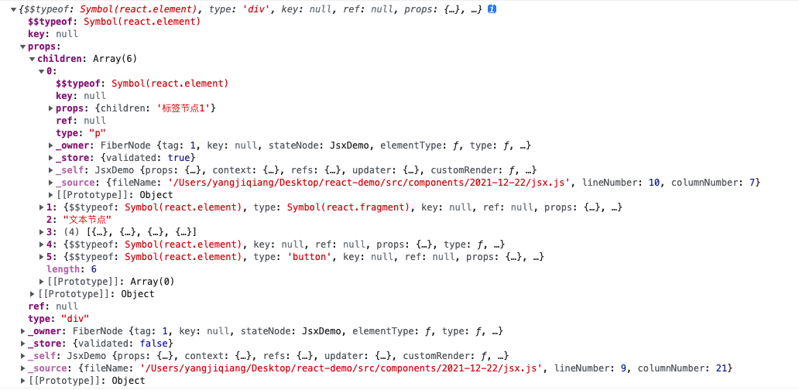
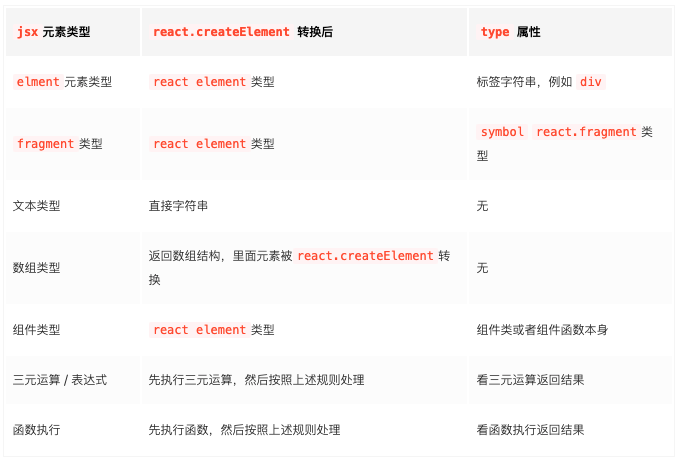
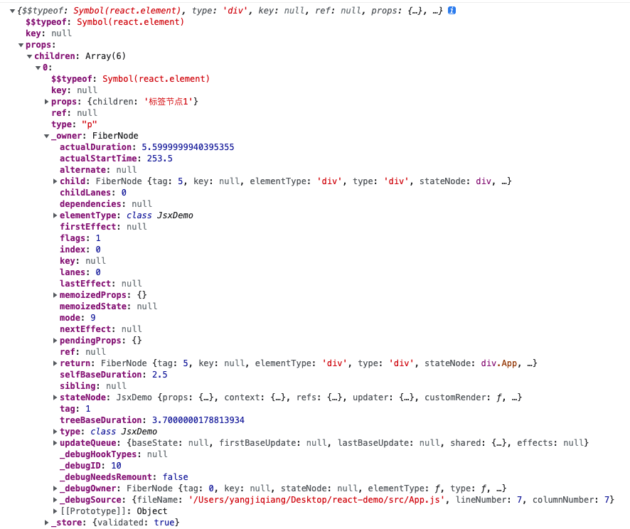
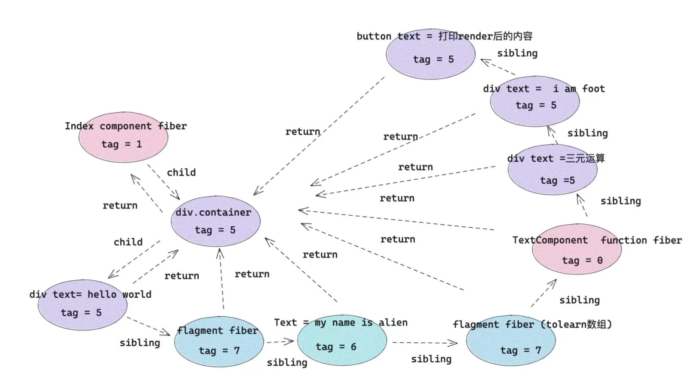

### 基本概念

jsx本质上是一个语法糖，它会在经过babel编译后变成React.createElement()语法。

### 基础原理

综上说述，jsx就是React.createElement函数的调用，下面通过一个案例一步步跟踪数据的处理，以便理解jsx的渲染过程。

#### jsx编译成React.createElement后的样子

下面是jsx代码块编译前后的对比

```js
const arrData = ['数', '组', '节', '点']
const TextComponent = () => (<div>component节点</div>)

function ReactJsxDemo() {
	return (
    <div>
      <p>标签节点1</p>
      <React.Fragment>
        <p>Fragment内的节点</p>
      </React.Fragment>
      文本节点
      {arrData.map(item => <span key={item}>{item}</span>)}
      <TextComponent />
    </div>
    )
}
```

```js
const arrData = ['数', '组', '节', '点'];

const TextComponent = () => /*#__PURE__*/React.createElement("div", null, "component\u8282\u70B9");

function ReactJsxDemo() {
  return /*#__PURE__*/React.createElement("div", null, /*#__PURE__*/React.createElement("p", null, "\u6807\u7B7E\u8282\u70B91"), /*#__PURE__*/React.createElement(React.Fragment, null, /*#__PURE__*/React.createElement("p", null, "Fragment\u5185\u7684\u8282\u70B9")), "\u6587\u672C\u8282\u70B9", arrData.map(item => /*#__PURE__*/React.createElement("span", {
    key: item
  }, item)), /*#__PURE__*/React.createElement(TextComponent, null));
}
```

> 这也是React为什么要在jsx里默认引入React的原因，就是为了避免jsx在转成React.createElement()后，找不到React导致报错

#### React.createElement处理后的样子



仔细观察可以得到一些结论

1. createElement返回的是一个Symbol对象，它的props.children属性里包含了所有的子节点
2. 子节点中，除文本节点外，也都是Symbol对象（数组中的具体项也是）
3. Symbol对象中包含type属性，值如下表。



#### Symbol(element)对象经过React底层调和后的样子

上述Symbol对象中还包含一个_owner属性，值为FiberNode对象，它跟Symbol对象是一一对应的。也就是Symbol对象最终都会生成一个与之对应的fiber对象，我们先看一下它的样子



关注点在sibling、return、child这三个属性中，它们是串联整个fiber树的逻辑描述

- child： 一个由父级 fiber 指向子级 fiber 的指针。
- return：一个子级 fiber 指向父级 fiber 的指针。
- sibling: 一个 fiber 指向下一个兄弟 fiber 的指针。

> sibling逻辑存在疑问，不是简单指向兄弟节点，经常为null

#### JSX最终形成的fiber结构图



### 实践与应用

### 