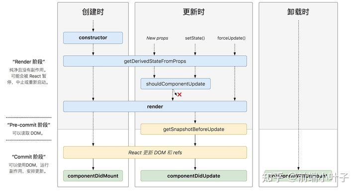

### 类组件生命周期

> React有两个重要的阶段，render阶段和commit阶段。render阶段会深度遍历fiber树，目的是发现不同。commit阶段会创建修改真实的DOM阶段。

#### 执行过程

##### 初始化阶段

1. **constructor 函数执行**
2. **getDerivedStateFromProps生命周期执行**
3. **render  函数**
4. **componentDidMount 生命周期执行**

##### 组件更新阶段

1. **执行生命周期 getDerivedStateFromProps**
2. **执行生命周期 shouldComponentUpdate**
3. **执行 render 函数**
4. **执行 getSnapshotBeforeUpdate**
5. **执行 componentDidUpdate**

##### 组件销毁阶段

1. **执行生命周期 componentWillUnmount**

#### 生命周期注解

##### constructor

组件构造函数

##### getDerivedStateFromProps

字面意思是从props中获取派生的state，它需是一个静态方法，无法获取this，返回值用于合并到state中。

##### componentDidMount

初始化阶段组件挂载完成

##### shouldComponentUpdate

是否重新渲染组件，它返回一个boolean值用于表示是否更新

##### getSnapshotBeforeUpdate

获取更新前快照，它的返回值会作为一个快照传递给componentDidUpdate作为第三个参数。

##### componentDidUpdate

组件更新完成

### 函数组件生命周期替代方案

> 函数组件是没有实例的，导致其没有钩子这一说法，所以react推出了hooks用于拓展函数组件的功能，函数组件生命周期的模拟主要是利用hooks中的useEffect和useLayoutEffect

##### useEffect

##### useLayoutEffect

其函数签名与 `useEffect` 相同，但它会在所有的 DOM 变更之后同步调用 effect。可以使用它来读取 DOM 布局并同步触发重渲染。在浏览器执行绘制之前，`useLayoutEffect` 内部的更新计划将被同步刷新

